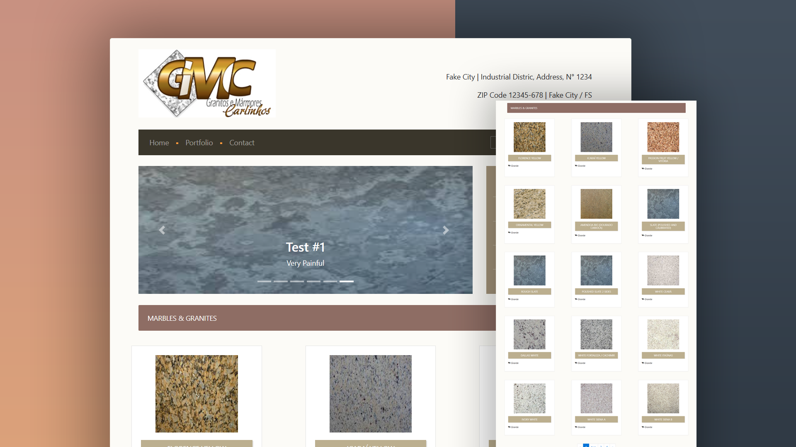

# GMC Marble & Granite
Website developed for a hometown marble & granite company as a freelancing project back in 2017.



# Developed with
* PHP 5.4
* JQuery 3.2
* Bootstrap 4
* MySQL 8.1

# How to run

Docker is required to run the application, please refer to [docker docs](https://docs.docker.com/get-docker/) for installation instructions.
<br>

1. Clone the repo
  ```
  git clone https://github.com/brunolexander/gmc.git
  ```
<br>

2. Navigate to the project's directory
  ```
  cd gmc
  ```
<br>

3. Start and run the application
  ```
  docker-compose up
  ```

4. Go to phpmyadmin through http://localhost:8081 and run the query located in main/db/db_gmc.sql
<br>
Done! You can access the application through the link http://localhost:8080.
